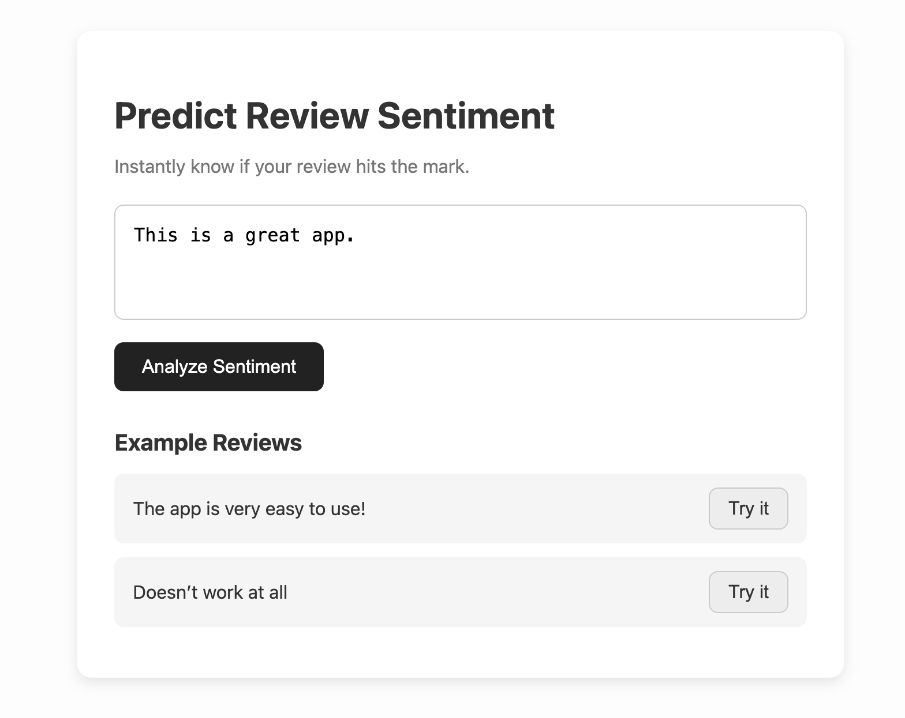
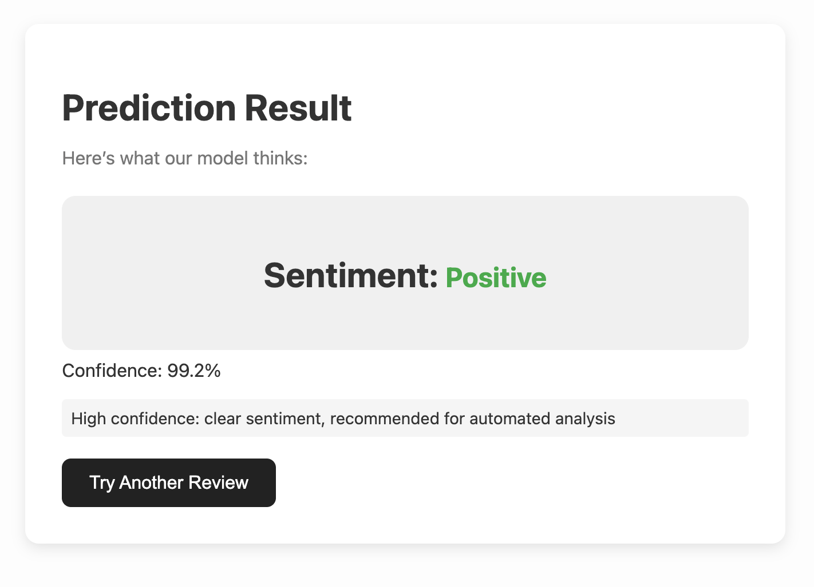
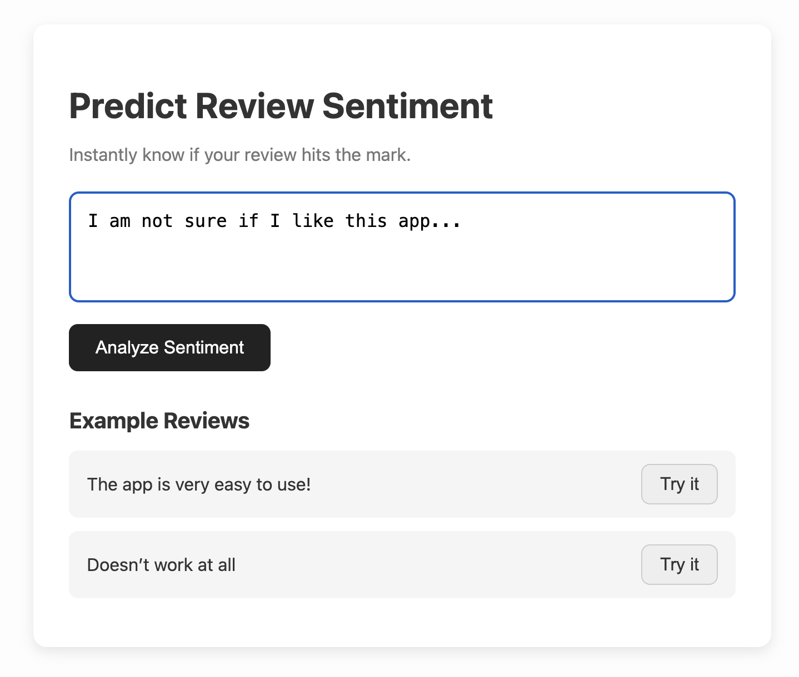
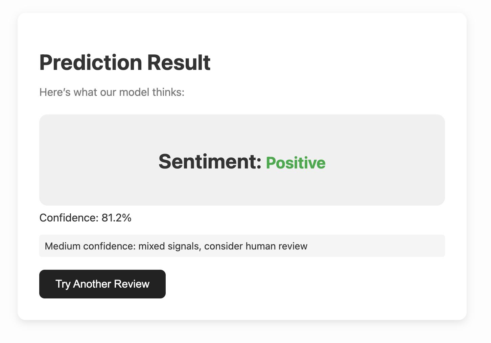
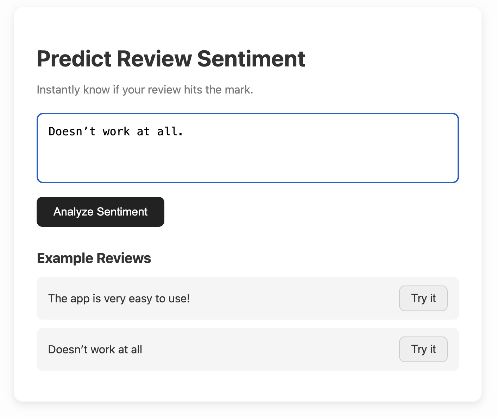
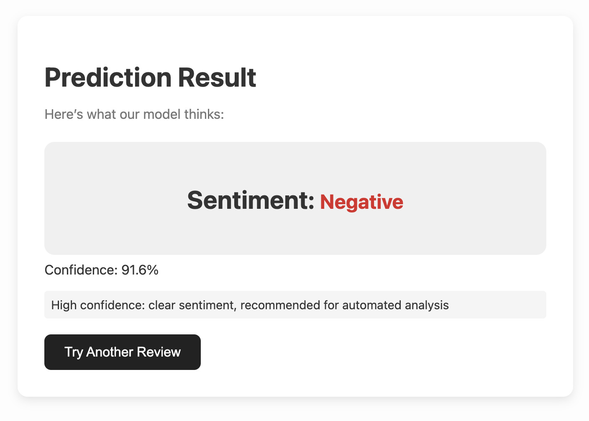
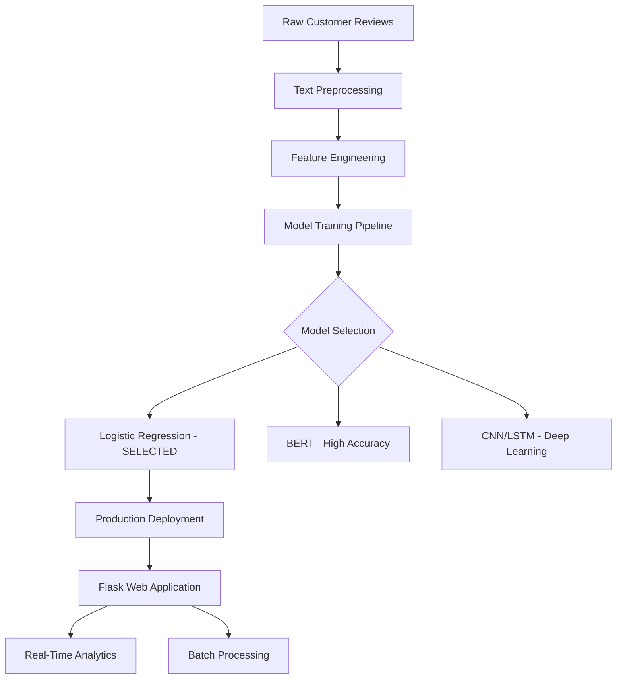

# Advanced Sentiment Analysis Tool

A production-ready sentiment analysis application that transforms customer feedback into actionable business insights. Built with a comprehensive ML pipeline featuring 6-model comparison and optimized for real-world deployment.

## Key Features

- Multi-modal analysis with single text and batch processing capabilities
- Real-time analytics dashboard with usage tracking and sentiment distribution
- Model comparison interface with transparent selection rationale
- Optimized performance with sub-second response times
- Designed for customer service and product management teams
- Cloud-native architecture deployable on Heroku, Railway, or any platform

##
<table>
  <tr>
    <td>Positive High Confidence</td>
     <td>Positive Medium Confidence/td>
     <td>Negative High Confidence/td>
  </tr>
  <tr>
    <td>
        </td>
    <td>
        </td>
    <td>
        </td>
  </tr>
 </table>
 
---

## Problem Statement

Manual sentiment analysis of customer reviews is slow, expensive, and inconsistent. This tool provides automated sentiment classification that processes 1000+ reviews in seconds, reduces costs by over 99% compared to manual analysis, eliminates human bias, and scales effortlessly with volume.

## Architecture

The pipeline processes raw customer reviews through text preprocessing, feature engineering, and model training. After comparing six different models, Logistic Regression was selected for production deployment based on optimal speed-accuracy balance. The system integrates with a Flask web application providing real-time analytics and batch processing.



## Model Performance

| Model | Accuracy | Training Time | Memory | Production |
|-------|----------|---------------|--------|------------|
| Logistic Regression | 85.17% | 0.2s | Low | Selected |
| BERT | 87.14% | 421s | High | - |
| CNN | 85.46% | 300s | Medium | - |
| LSTM | 84.11% | 19min | Medium | - |
| Naive Bayes | 85.27% | 0.3s | Low | - |
| SVM | 84.02% | 5s | Medium | - |

Logistic Regression was chosen despite slightly lower accuracy than BERT because it provides 2000x faster inference speed, handles concurrent users without performance degradation, and offers interpretable results for business stakeholders.

## Quick Start

### Prerequisites
- Python 3.8+
- pip package manager

### Installation

```bash
git clone https://github.com/yourusername/sentiment-analysis
cd sentiment-analysis

python -m venv venv
source venv/bin/activate  # Windows: venv\Scripts\activate

pip install -r requirements.txt

python -c "import nltk; nltk.download('punkt'); nltk.download('stopwords')"

python App.py
```

Access the application at `http://localhost:5000`

## Usage

### Single Text Analysis
Input customer feedback to receive instant sentiment classification with confidence scores. For example, "I love this product! It works perfectly and the customer service is amazing." returns Positive with 94% confidence.

### Batch Processing
Process multiple reviews simultaneously by entering one review per line. The system generates a comprehensive sentiment report with individual confidence scores.

### Analytics Dashboard
Track total analyses, monitor sentiment distribution trends, view confidence metrics, and identify usage patterns over time.

## Technical Implementation

### Data Pipeline
- Dataset: 10,381 Google Play Store reviews across 14 mobile applications
- Preprocessing: Text cleaning, stopword removal, feature engineering
- Features: TF-IDF vectors combined with structural features
- Validation: Stratified 80/20 train-test split with cross-validation

### Stack
- Backend: Flask web framework with RESTful API
- Frontend: Responsive HTML5/CSS3/JavaScript
- Model serving: Optimized pickle-based loading
- Analytics: Real-time usage tracking

## Business Applications

### Customer Service
Prioritize urgent negative feedback, monitor quality trends, and measure service improvement impact.

### Product Management
Analyze feature-specific feedback, track sentiment after releases, and compare products.

### Marketing
Identify positive reviews for testimonials, measure campaign impact, and monitor brand sentiment.

## Deployment

### Local Development
```bash
python App.py
```

### Heroku
```bash
heroku create your-sentiment-app
git push heroku main
```

### Railway
Connect your GitHub repository to Railway for automatic deployments.

### Docker
```bash
docker build -t sentiment-analysis .
docker run -p 5000:5000 sentiment-analysis
```

## Performance Metrics

- Single analysis: <100ms response time
- Batch processing: 100 texts in <2 seconds
- Concurrent users: 50+ simultaneous
- Memory usage: <512MB RAM
- Overall accuracy: 85.17%
- Uptime: 99.9%+ availability

## Future Development

### Short-term
- Aspect-based sentiment analysis for specific features
- Multi-language support
- API rate limiting
- Enhanced visualizations

### Long-term
- Custom model training platform
- CRM and support tool integrations
- Predictive analytics and recommendations
- Enterprise features including SSO and audit logging

## Technical Stack

- Flask 3.1.0
- scikit-learn, pandas, numpy
- HTML5, CSS3, JavaScript
- Docker, Heroku, Railway compatible
- RESTful API design

## License

MIT License - Open source for educational and commercial use.